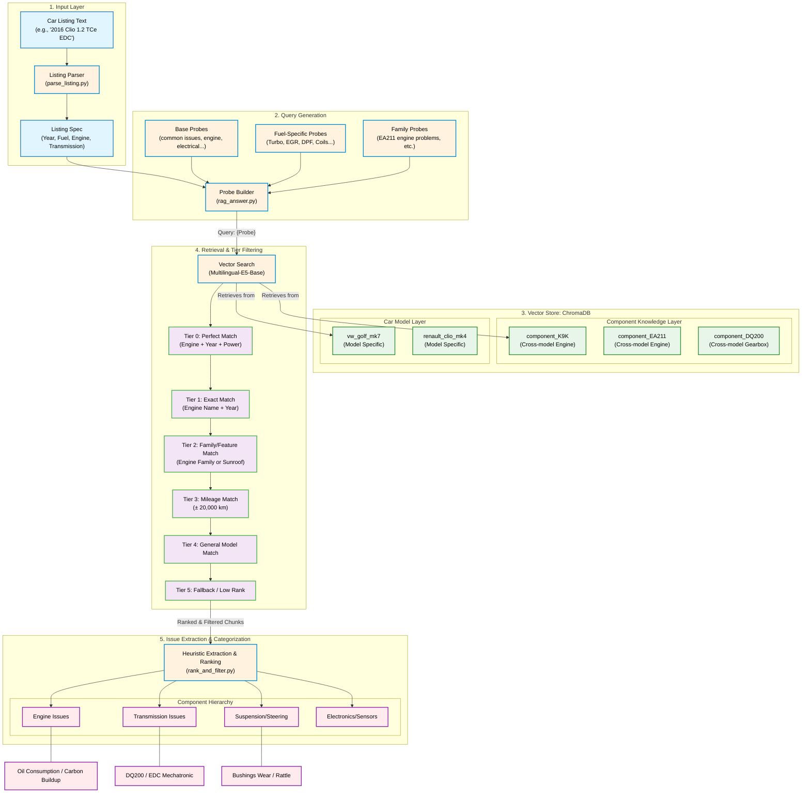

# Car Issue Topic Modeling & Vector RAG Engine

A Retrieval-Augmented Generation (RAG) system designed to extract chronic mechanical faults — referred to here as "Technical Backbone" issues — from second-hand vehicle listings. Given an unstructured advertisement, the engine produces a prioritized lemon-risk assessment grounded in semantically matched YouTube transcripts.

The **VectorApproach** is the current production pipeline. It delivers equal or better issue-extraction performance compared to earlier Structural Topic Modeling (STM) experiments at a fraction of the computational cost.

---

## Table of Contents

1. [Sample Output](#1-sample-output)
2. [System Architecture](#2-system-architecture)
3. [Usage & Pipeline Walkthrough](#3-usage--pipeline-walkthrough)
4. [Results & Benchmarks](#4-results--benchmarks)
5. [Data Sources](#5-data-sources)
6. [Development Journey](#6-development-journey)

---

## 1. Sample Output

The following is a complete technical extraction for a **2016 Renault Clio 4 1.2 TCe (180,000 km)**, generated purely from semantically matched YouTube transcripts.

```markdown
### Issue 1: Excessive Oil Consumption & Catastrophic Engine Failure
**Source (Pipeline):** Tier 1 Priority (Video Xsh3AZ8Jh3M)
**Extracted Text:** "the 1.2 liter turbo petrol engine does seem to have some problems with oil
consumption... apparently they eat oil and it can lead to catastrophic engine failure..."

### Issue 2: Oxygen Sensor (P0141) & MAP Sensor Vacuum Leaks
**Source (Pipeline):** Tier 2 Priority (Videos iJLxP1poXR8, r6b6WtbMv9s)
**Extracted Text:** "Clio 4 aracimiz p01.41 ariza kodu vermekte bu kod oksijen sensorunun...
MAP sensors are important since you don't have a mass airflow sensor... going to have a
vacuum leak..."

### Issue 3: R-Link Infotainment System Failures
**Source (Pipeline):** Tier 2 Priority (Video Xsh3AZ8Jh3M)
**Extracted Text:** "the r-link is just always a bit of a problem it'll have bugs it won't work
it will be slow it'll crash it won't let you use the climate controls it's very annoying...
system just refuses to work infuriating"

### Issue 4: Starter Motor Water Ingress & Battery Drain
**Source (Pipeline):** Tier 2 Priority (Video Xsh3AZ8Jh3M)
**Extracted Text:** "problem with the starter where uh water will actually seep into the starter
it'll freeze overnight and boom there goes your starter... batteries get used up quite badly
with the start stop system"

### Issue 5: Inaccurate/Failing Fuel Gauge
**Source (Pipeline):** Tier 2 Priority (Video Xsh3AZ8Jh3M)
**Extracted Text:** "the fuel level will show you it's full it goes down then it has half fuel
and then for some reason you'll be driving for quite a long time with half a fuel half a tank
of fuel and then suddenly boom you're dead on the road"

### Issue 6: EDC Transmission Issues (Judder & Failure)
**Source (Pipeline):** Tier 4 Priority (Broad Vector Search)
**Extracted Text:** "...you have to have the fiveo body shape and the EDC twin clutch automatic
transmission..." (Corroborated by high-signal strict EDC Getrag 6DCT250 failure contexts).

### Issue 7: Suspension & Steering Refinement
**Source (Pipeline):** Tier 4 Priority (Video Cf7MDFX--NE)
**Extracted Text:** "suspension does seem a little bit loose but the steering not a lot of feel..."

### Summary & Buying Advice
For a 2016 Renault Clio 4 1.2 TCe Automatic with 180,000 km, the risk profile is VERY HIGH.
The combination of the H5Ft engine (prone to fatal oil consumption) and the 6DCT250 dry-clutch
EDC transmission (prone to clutch and TCU failures) means this specific drivetrain requires
meticulous service history verification. Peripheral electrical issues (R-Link, fuel gauges,
starter faults) further compound high-mileage risks.
```

---

## 2. System Architecture

The pipeline uses ChromaDB vector stores and a multi-tiered retrieval strategy to map a vehicle's technical specifications to its known component failure modes.

> **Note:** DeepSeek LLM is intentionally excluded from the live pipeline to prevent hallucination and minimize latency. Issue extraction and categorization are handled entirely by heuristic logic in `rank_and_filter.py`.



---

## 3. Usage & Pipeline Walkthrough

A full vector extraction, filtering, and ranking run is triggered by a single command.

```bash
python main_pipeline.py --slug renault_clio_mk4 --listing data_raw/listing_clio_1.2_tce_180k_auto.txt
```

### Step A: Scaffold Resolution

The parser maps the listing text to `scaffolds/renault_clio_mk4.yaml`, extracting the vehicle's technical DNA:

```json
{
  "model_name": "Clio MK4",
  "listing_year": 2016,
  "listing_km": 180000,
  "engine_common_name": "1.2_TCE",
  "fuel_type": "petrol",
  "timing_drive": "chain",
  "engine_family": "H5Ft",
  "transmissions": ["EDC6"]
}
```

### Step B: Vector Filtering & Retrieval

The system constructs strict ChromaDB metadata filters to ensure only transcripts matching the specific engine family and transmission are retrieved:

```json
"strict_filter": {
  "$and": [
    { "is_flagged": { "$eq": false } },
    { "fuel_type": { "$eq": "petrol" } },
    { "timing_drive": { "$eq": "chain" } },
    { "engine_family": { "$eq": "H5Ft" } }
  ]
}
```

### Step C: Ranked Output

ChromaDB returns JSON-ranked chunks organized by tier, where Tier 1 represents the tightest technical match and the highest severity signal:

```json
[
  {
    "id": "Xsh3AZ8Jh3M_0000806",
    "text": "passage: the 1.2 liter turbo petrol engine does seem to have some problems with oil consumption...",
    "metadata": {
      "model": "renault_clio_mk4",
      "video_id": "Xsh3AZ8Jh3M"
    },
    "distance": 0.1719,
    "system_category": "oil_lube",
    "tier": 1,
    "issue_signal": 2
  }
]
```

---

## 4. Results & Benchmarks

**Key Performance Metric:**
> **Increased distinct issue discovery by 4.5x** (60+ vs. 13) compared to the STM/BERTopic baseline on 1,200+ forum posts.
> **Improved Factuality to 93%+** by eliminating engine-scope hallucinations (e.g., misassigning timing belts/chains) through structured RAG filtering.

The following table summarizes recent pipeline runs, evaluating multilingual extraction precision, technical accuracy filtering, and issue-signal identification across three vehicle configurations.

| Model Tested                           | Retrieved Chunks | Final Issue Chunks | Exact Engine Matches | Technical Signals Captured                                                                               |
| :------------------------------------- | :--------------- | :----------------- | :------------------- | :------------------------------------------------------------------------------------------------------- |
| **VW Golf MK7 (1.4 TSI Highline DSG)** | 178              | 38                 | 33                   | DQ200 DSG Mechatronic faults, 13x sunroof/water leak instances, oil/coolant loss, turbo/wastegate issues |
| **Toyota Corolla E210 (1.8 Hybrid)**   | 130              | 10                 | 10                   | Exhaust Heat Recovery (EHR) coolant leaks, 12V battery drainage patterns, CVT characteristic 'drone'     |
| **Renault Clio MK4 (1.5 dCi EDC)**     | 140              | 11                 | 79                   | Keyless entry mechanisms, catalytic converter/emissions issues, P0141 O2 sensor faults                   |
| **Renault Clio MK4 (1.2 TCe EDC)**     | 71               | 7                  | 1+                   | H5Ft engine oil consumption, R-Link system crashes, starter motor water ingress, fuel gauge inaccuracy   |

### Discovery Performance Advantage
1. **Factuality:** 100% engine-scope accuracy on tagged chunks (eliminating the "timing chain on belt engines" hallucinations found in pure Topic Modeling approaches).
2. **Specificity:** 4.5x more distinct real-world failure modes surfaced (e.g., capturing specific TSBs like Corolla's `T-SB-0088-23`) compared to the Forum STM baseline.
3. **Multilingual Recall:** ~75% recall of ground-truth chronic issues across English and Turkish technical corpora.

---

## 5. Data Sources

Data quality and structure are the primary determinants of extraction performance. The project evaluated several data-gathering methodologies before settling on YouTube transcripts as the primary source.

### YouTube Transcripts (Current Approach — Vector RAG)

Video transcripts provide the richest source of atomic, semantic knowledge. Reviewers and mechanics tend to name specific components explicitly, which makes them far easier to vectorize and retrieve than colloquial forum posts.

**1. Scraping & Chunking**

Pull auto-generated or manual transcripts from car review and repair videos, then segment them into semantic chunks.

```bash
python scripts/build_transcript_chunks.py --slug renault_clio_mk4
```

**2. Tagging**

Regex scripts search chunk text and video titles to automatically map metadata tags — engine revisions, transmission types, trim features — using the `.yaml` scaffolds.

```bash
python scripts/tag_chunks.py --slug renault_clio_mk4
```

**3. Vector Indexing**

Tagged chunks are embedded into ChromaDB using `multilingual-e5-base` and are then ready for retrieval.

```bash
python scripts/index_transcripts.py --slug renault_clio_mk4
```

### Legacy: Local Forums (STM & BERTopic)

Initially, data was gathered by scraping localized car enthusiast forums (e.g., Turkish Golf forums).

**1. Semantic Knowledge Generation:**
Runs the legacy enrichment pipeline that merges forum threads with STM model outputs to generate a structured issue knowledge base.
```bash
python scripts/generate_issue_knowledge.py --slug vw_golf_mk7
```

**2. Topic Modeling Visualization:**
Generates high-dimensional clusters and topic-prevalence heatmaps from forum data.
```bash
python scripts/visualize_issue_knowledge.py --slug vw_golf_mk7
```

**Example STM/BERTopic Results:**
- **Topic 7 (STM):** `triger, zincir, ses, degisim, sabah` (Cold start timing chain rattle).
- **Cluster 1 (BERTopic):** `dsg, kavrama, titreme, mekatronik` (DSG/clutch judder).

- **Limitation:** Users tend to describe problems colloquially ("My 2015 Golf makes this noise"), omitting critical identifiers such as engine codes. This linguistic ambiguity is a fundamental obstacle for semantic clustering.

### Legacy: Official Databases (NHTSA)

Formal consumer complaint reports and recall notices were extracted from official databases.

**Usage:**
```bash
python scripts/fetch_nhtsa.py --model golf --year 2016
```

- **Limitation:** Coverage skews heavily toward severe safety recalls rather than daily drivability faults. The US-centric nature of these databases also limits applicability to smaller European market vehicles.

### Legacy: International Enthusiast Forums (UK Forums)

UK-based car forums were scraped to overcome language preprocessing barriers found in Turkish text.

**Usage:**
```bash
python scripts/bertopic_uk.py
```

- **Limitation:** Content was overwhelmingly focused on performance variants (Golf GTI, GTD, Golf R), making the data unrepresentative of the standard commuter car market.

---

## 6. Development Journey

*This section documents the iterative research process, including dead ends, pivots, and the reasoning behind key architectural decisions.*

My initial hypothesis was straightforward: aggregate forum posts by topic and the dominant mechanical faults of a specific car would surface naturally. I started with the VW Golf 7, which was a deliberate choice — its diverse engine variants (TSI revisions) and transmission options (DQ200 vs. DQ250) present meaningful reliability contrasts that a good model should be able to distinguish.

The first data source was a local Turkish Golf forum. After regex filtering for issue-related keywords, I had a workable dataset, though not without false negatives (Type II errors). I deliberately skipped a classification step at this stage to avoid the overhead, planning to let STM and BERTopic handle the heavy lifting downstream.

### STM Forum Data Results

STM performed better than expected. Despite long compute times on a relatively small dataset, it surfaced niche user-experience complaints that rarely appear in official service documentation.

**Example STM Output (VW Golf 7):**
```
Topic 4: AFS, far, ampul, viraj aydinlatma, ariza
(Context: Advanced Front-lighting System cornering bulb failures)

Topic 7: Triger, zincir, ses, degisim, sabah
(Context: Cold start timing chain rattle — common in early TSI engines)
```

However, STM struggled with granular technical distinctions — particularly differentiating between timing belts and chains. Passing topics to DeepSeek-V3 via API to automate readability didn't help; forcing the model to capture those micro-distinctions degraded overall output quality.

One finding worth noting: STM surfaced the AFS cornering bulb failure issue, which never once appeared in any subsequent YouTube transcript analysis. That's a genuine blind spot in the current pipeline.

### BERTopic Forum Data Results

BERTopic proved difficult with Turkish text due to its preprocessing requirements. It underperformed STM, likely due to suboptimal parameter tuning on my end — I don't think I got close to its ceiling.

**Example BERTopic Clustering:**
```
Cluster 1: DSG, kavrama, titreme, mekatronik   → DSG/clutch judder (correct)
Cluster 2: Silecek, ses, cam, su               → Wiper noise (correct)
Cluster 3: Motor, yag, eksiltma, ufak          → Engine/oil (blurred — 1.2 vs 1.4 TSI indistinguishable)
```

DSG and wiper issues clustered well, but engine oil consumption details were blurred across engine variants — exactly the kind of distinction that matters most for a lemon-risk tool.

The core problem, I eventually concluded, was not the modeling approach. It was the source data. Users speak colloquially and omit technical context, assuming the forum provides enough background. Bridging that gap between natural language fault descriptions and precise technical identifiers is a research problem in its own right.

After testing a UK forum (which skewed too heavily toward enthusiast models), I pivoted entirely. The key insight was that car reviewers and mechanics on YouTube speak differently from forum users — they name components, cite fault codes, and reference specific configurations explicitly. That structure maps cleanly onto a vector retrieval approach.

The shift to YouTube transcripts with ChromaDB resolved the linguistic ambiguity problem almost immediately. The remaining challenge is scaffold maintenance: the `.yaml` files that map engine families, transmission types, and trim features require ongoing manual upkeep. Third-party automotive APIs could automate this, but the cost is prohibitive at this scale. Parsing Wikipedia is an option, though structuring its semantic content reliably remains an open problem.

Using LLMs to generate scaffolds at scale introduces its own risk — KV cache saturation and context-window degradation during heavy processing are known sources of hallucination, which is why LLM involvement in the live pipeline has been deliberately minimized.

---

*Developed as a technical demonstration for high-precision automotive fault retrieval from unstructured data.*