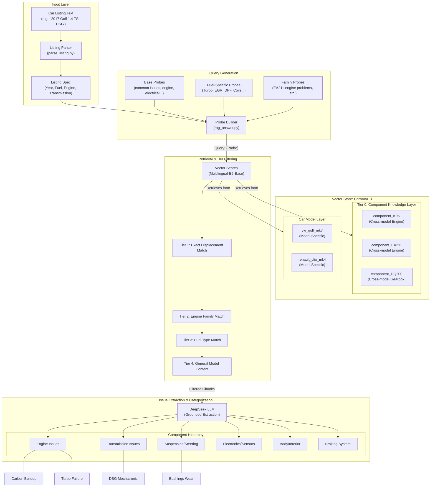

# Vector-Based Issue Extraction Architecture

This diagram illustrates the hierarchical approach used to extract car issues using ChromaDB vector stores and multi-tiered retrieval strategies.

## System Architecture Diagram

## Key Components of the Approach

1.  **Listing Specification (`ListingSpec`)**: The system first translates a raw ad into a structured specification (year, fuel, engine code).
2.  **Neutral Probing**: Instead of searching for "broken DSG", the system uses neutral probes like "transmission problems" or "{engine_code} engine experience" to avoid bias and discover unknown issues.
3.  **Multi-Tiered ChromaDB**:
    *   **Component Layer (Tier 0)**: Contains specialized knowledge about specific engines (like the K9K) or transmissions (like DQ200) regardless of the car model they are in.
    *   **Car-Level Layer**: Contains model-specific transcripts and forum discussions.
4.  **Graceful Relaxation (Tiers 1-4)**: The system first tries to find evidence matching the exact engine. if not enough evidence is found, it relaxes the filter to the engine family, then fuel type, and finally general model content.
5.  **Component-Centric Output**: The final extraction groups issues into logical automotive components (Engine, Transmission, Suspension, etc.), providing a clear "lemon" risk assessment for the user.
